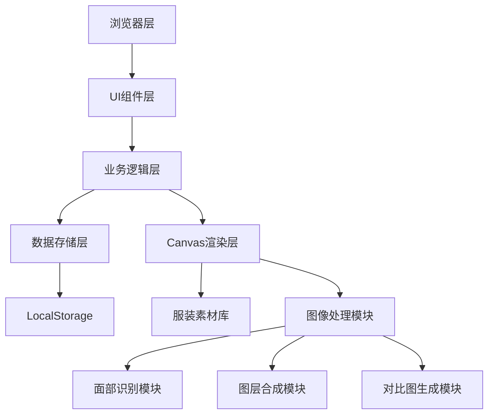

## 1. 架构设计

纯前端应用，所有图像处理在浏览器Canvas完成，无需后端服务。



## 2. 技术描述

- **前端框架**：React@18 + TypeScript
- **构建工具**：Vite@5
- **样式方案**：Tailwind CSS@3
- **状态管理**：Zustand
- **路由管理**：React Router DOM@6
- **图标库**：Lucide React
- **图像技术**：HTML5 Canvas API（原生）
- **数据存储**：LocalStorage（本地）
- **图像识别**：前端Canvas像素分析（自研算法）
- **初始化方式**：npm init vite-init

## 3. 核心技术方案

### 3.1 面部与肩部识别算法
- 使用Canvas像素分析检测肤色区域定位面部
- 基于垂直投影直方图确定肩部位置
- 基于边缘检测算法识别轮廓
- 提供手动调整功能校准识别结果

### 3.2 服装贴合算法
- 根据识别的肩部宽度计算服装缩放比例
- 基于领口位置自动对齐服装
- 支持仿射变换实现服装透视贴合

### 3.3 对比图生成
- 三图拼接，分辨率1000×1200像素
- 自动居中排列，带标签标注
- 支持导出为PNG格式下载

## 4. 目录结构

```
src/
├── components/
│   ├── CanvasEditor/       # Canvas编辑器组件
│   ├── CostumePanel/        # 服装选择面板
│   ├── ControlPanel/       # 微调控制器
│   ├── SchemeManager/     # 方案管理
│   ├── CompareGenerator/  # 对比图生成器
│   └── common/           # 通用组件
├── hooks/
│   ├── useCanvas.ts       # Canvas操作hook
│   ├── useDetection.ts    # 面部识别hook
│   └── useStorage.ts     # 本地存储hook
├── store/
│   ├── useEditorStore.ts # 编辑器状态管理
├── data/
│   ├── costumes.ts        # 服装库数据
│   └── headpieces.ts     # 盔头库数据
├── utils/
│   ├── canvasUtils.ts       # Canvas工具函数
│   ├── detectionUtils.ts  # 识别算法工具
│   └── imageUtils.ts    # 图像处理工具
├── pages/
│   ├── EditorPage.tsx     # 主编辑页
│   ├── SchemesPage.tsx   # 方案管理页
│   └── ComparePage.tsx  # 对比图生成页
├── types/
│   └── index.ts          # 类型定义
├── App.tsx
├── main.tsx
└── index.css
```

## 5. 数据模型

### 5.1 类型定义

```typescript
interface Costume {
  id: string;
  name: string;
  category: 'mangpao' | 'kao' | 'pei' | 'zhezi' | 'guanyi';
  color: string;
  pattern: string;
  imageUrl: string;
  defaultScale: number;
  defaultOffsetY: number;
}

interface Headpiece {
  id: string;
  name: string;
  type: 'wangmao' | 'xiangdiao' | 'samao' | 'fengguan' | 'zijinguan' | 'other';
  imageUrl: string;
  defaultScale: number;
  defaultOffsetY: number;
}

interface LayerState {
  x: number;
  y: number;
  scale: number;
  rotation: number;
}

interface OutfitScheme {
  id: string;
  name: string;
  createdAt: number;
  thumbnail: string;
  costumeId: string | null;
  headpieceId: string | null;
  costumeLayer: LayerState;
  headpieceLayer: LayerState;
  landmarks: Landmarks;
}

interface Landmarks {
  faceCenter: { x: number; y: number };
  leftShoulder: { x: number; y: number };
  rightShoulder: { x: number; y: number };
  neckBase: { x: number; y: number };
}
```

### 5.2 存储键名

- `outfit_schemes`: 存储搭配方案数组（JSON序列化）
- `max_schemes`: 20套上限

## 6. 核心算法指标

- 轮廓贴合误差 ≤ 15%
- 方案保存/加载成功率 100%
- 对比图分辨率 ≥ 1000×1200像素
- 响应时间 ≤ 2秒内完成贴合

## 7. 素材要求

- 行头数量：30种以上
  - 蟒袍：8种（红团龙蟒、绿团龙蟒、黄团龙蟒、白团龙蟒、黑团龙蟒、紫团龙蟒、蓝团龙蟒、粉团龙蟒
  - 靠：6种（红靠、绿靠、白靠、黑靠、蓝靠、粉靠
  - 帔：6种（红帔、蓝帔、紫帔、绿帔、黄帔、粉帔
  - 褶子：6种（红褶子、蓝褶子、白褶子、黑褶子、紫褶子、绿褶子
  - 官衣：6种（红官衣、紫官衣、蓝官衣、绿官衣、黑官衣、粉官衣
- 盔头数量：15种以上
  - 王帽、相貂、纱帽、凤冠、紫金冠、夫子盔、蝴蝶盔、凤翅盔、七星额子、大额子、小额子、忠靖冠、纯阳巾、文生巾、相巾

## 8. 质量验收标准

1. 服装试穿人体轮廓贴合误差 ≤ 15%
2. 造型保存和加载零失败
3. 对比图生成分辨率 ≥ 1000×1200像素
4. 所有功能在Chrome、Firefox、Edge浏览器正常运行
5. 支持键盘快捷键操作：方向键移动，+-缩放
